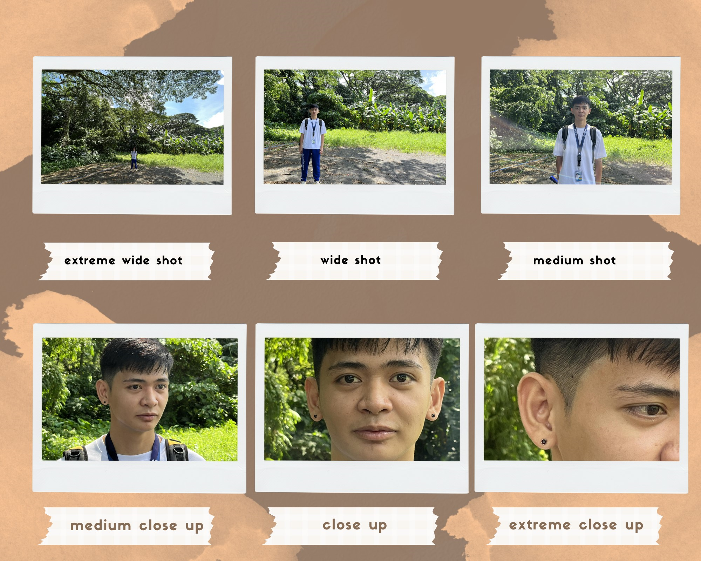

# Resume

### Objective
Motivated and detail-oriented third-year BSIT student with hands-on experience in software development, database management, and network administration. Seeking opportunities to apply technical skills and gain industry experience in a dynamic IT environment.

### Education
- Bachelor of Science in Information Technology
- Philippine Christian University

### Skills
- Programming Languages: Python, Java, C++, HTML/CSS, JavaScript, SQL
- Web Development: Front-end (HTML5, CSS3, JavaScript, React), Back-end (Node.js, Express)
- Database Management: MySQL, PostgreSQL, MongoDB
- Tools & Software: Git, Visual Studio Code, Eclipse, Android Studio, Microsoft Office Suite
- Operating Systems: Windows, Linux (Ubuntu)
- Other Skills: Troubleshooting, Network Configuration, Cloud Services (AWS or Google Cloud), Team Collaboration

### Hobbies
- playing online games
- basketball
- watching movies

### Projects

